# Side Order Palette Planner

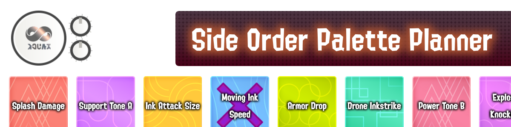

A tool for making, playing, and sharing palettes for Splatoon 3's roguelite mode Side Order!

It's especially designed for people who enjoy playing custom Side Order palette categories like Palette Art and Music Palettes!

Try it for yourself at [epicyoshimaster.github.io/side-order-palette-planner](https://epicyoshimaster.github.io/side-order-palette-planner)!

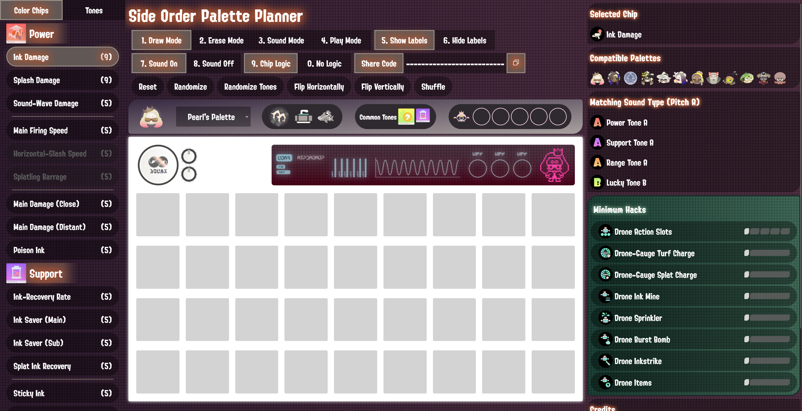

## Terminology

Before talking about features, it's helpful to briefly introduce some of the terms used by this tool!

### Color Group

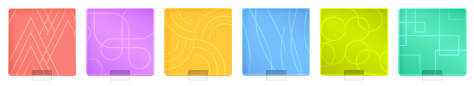

A **Color Group** categorizes abilities according to their function and their overall color.

There are six in total:

- **Power** - Red
- **Support** - Purple
- **Range** - Orange
- **Mobility** - Blue
- **Lucky** - Lime
- **Drone** - Teal

### Tone

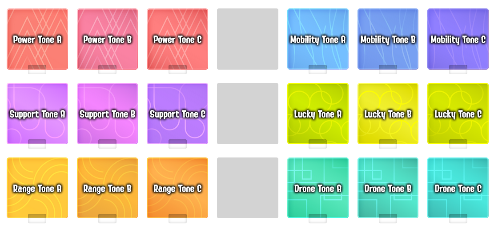

**Tones** are subcategories of a particular color group, defined by a slight variation in their overall color.

Each group has three tones, which I refer to as **Tone A**, **B**, and **C**.

Tones have relatively low contrast differences to each other, so they can sometimes be difficult to visually distinguish.
This tool contains a labelling feature to help you tell them apart!

### Color Chip

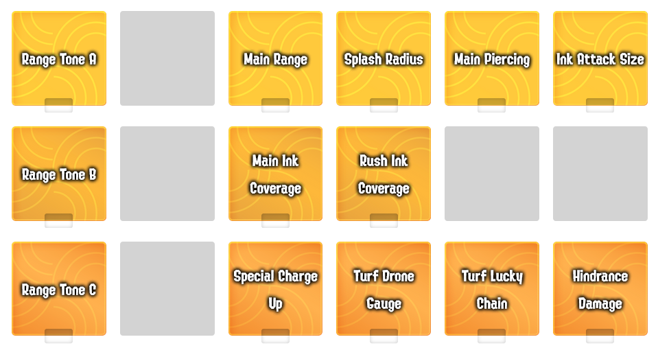

**Color Chips** are subcategories of tones, corresponding to a particular ability which usually relates to the overall color group.

To name an example, Main Ink Coverage, which increases the amount of ink you put on the ground when using your main weapon, is a Range Tone B Color Chip.

Some tones are quite organized as far as which abilities are where, while others can feel a bit random.

This tool allows you to place any combination of **Color Chips** or **Tones**, which you can think of as wildcards that can refer to any of the color chips within its particular tone.

### Palette

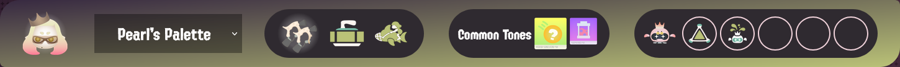

A **Palette** typically refers to one of two things:

1. The overall combination of a character (say, Pearl), their main weapon (Order Dualies), sub weapon (Curling Bomb), special weapon (Reefslider), and their color chip biases (Lucky primary, Support secondary).
2. The particular color chips that you have placed on the 36 slot grid.

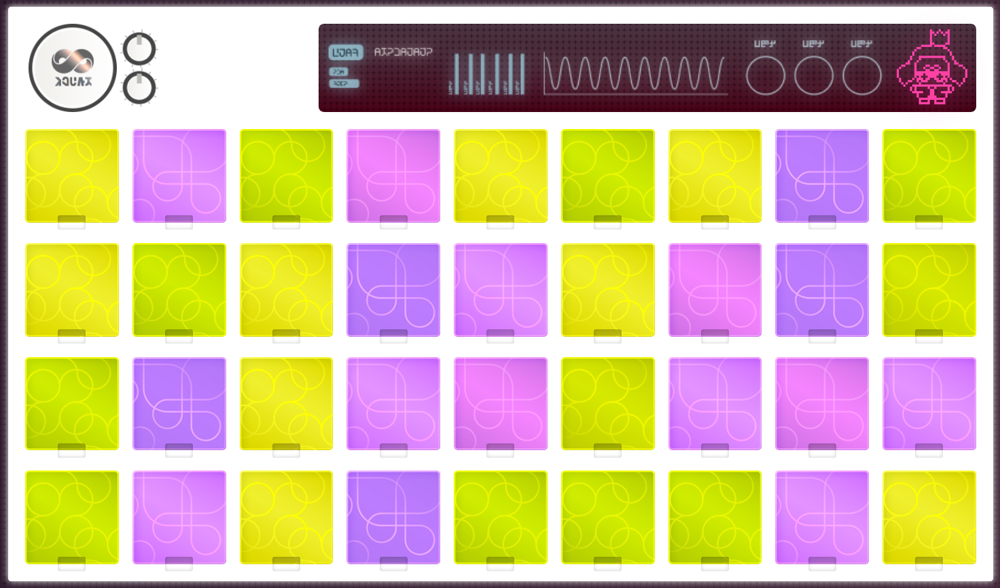

## Modes

The Palette Planner features several modes and features which you can use to build palettes in a wide variety of ways.

### Draw Mode

**Draw Mode** allows you to draw on the individual slots of the Palette with whatever Color Chip or Tone you have selected.

Pick a particular Color Chip or Tone on the left menu to select it.

Then, click on a slot to place it, or, click and hold then drag your mouse around to place many at a time.

### Erase Mode

**Erase Mode** will remove color chips that you've placed on the palette.

Click on a slot to erase it, or, click and hold then drag your mouse around to erase many at a time.

### Sound Mode

Did you know the Color Chips in Side Order are associated with sounds?

While playing in-game, if you go to the palette menu and select a chip, you can click on the chips to play sounds!

There's even an easter egg for the palette used in the final phase of the initial Overlorder fight!

Each sound is associated with a particular Tone, and with **Sound Mode** you can click on Color Chips or Tones (even the ones on the selector menu) to play their sounds.

This mode will also respect whether you have the Sound setting on or off, so be sure to double check if it's enabled if you aren't hearing anything!

### Play Mode

**Play Mode** will highlight the first chip placed on the palette to use as a marker.
If you press the left and right arrow keys, or use the arrow buttons which appear, you can move the marker around which is very handy to track your progress while playing the palette in-game!

On the right side, you can see more detailed information about the particular color chip you have marked and the palette as a whole.

This includes things like which palettes are compatible with the color chip, which tones match the associated sound type

This includes:

- For color chips, the palettes this chip is compatible with
- For tones, the color chips that correspond to that tone
- The sound type for a chip, and information on other chips that share a similar sound type to help with making music palettes
- Potential hacks required for overall palette, which is relevant for anything using Drone chips

## Additional Features

### Labels

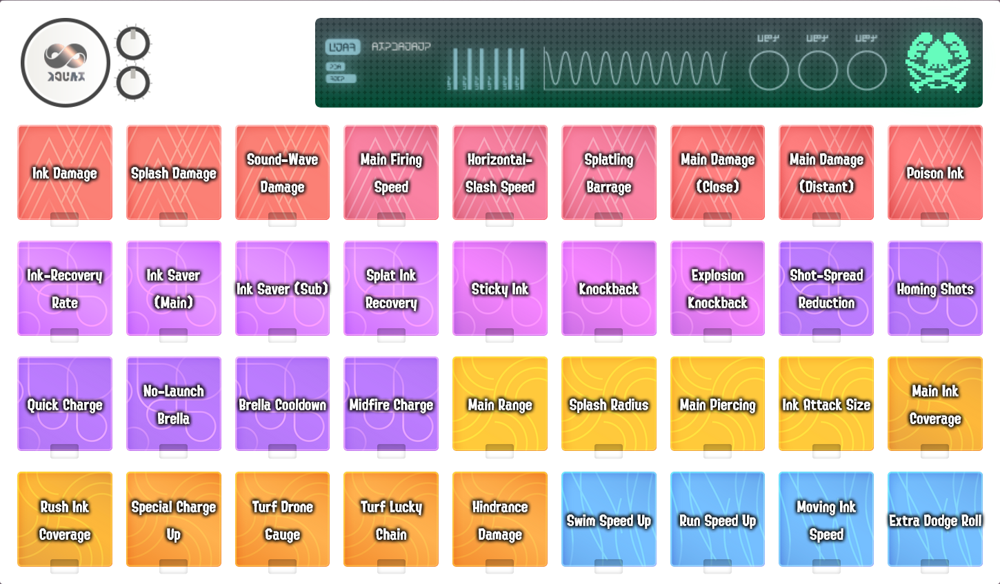

Enabling the labels option will display labels for the tones selector menu and any of the chips you have placed.

This is handy to identify what you've placed specifically, and you can always turn it off for when you might want just the overall colors.

### Sound Toggle

By default, you'll hear sounds when placing and removing chips, as well as when using sound mode.

The sound option allows you to toggle them on or off!

### Chip Logic

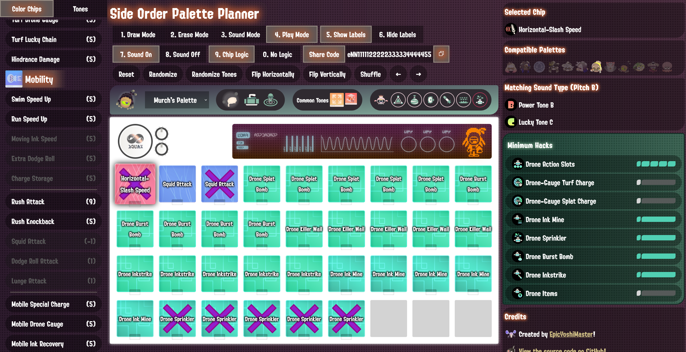

There's a whole bunch of ways a palette can be made impossible to complete!

- You could accidentally include a color chip that can only be used by a different palette.
- You could place too many of a particular chip down beyond their actual total.
- You could have too many drone chips placed down resulting in more abilities than you can actually have at once.
- You could use Eight's Palette and need hacks to complete your palette which reduces the overall number of chips you can place.

Chip Logic attempts to help with all of these (as much as it can)!

When enabled, all chips placed will be verified for the conditions above to be sure they'll be possible to place!

If a chip fails, it'll be marked with a purple X, letting you know it won't work if you try to play it in-game.
This validation works even with combinations of color chips and tones, and attempts to cover basically everything you could need.

The UI will also indicate some of these conditions, with things like disabling the buttons for chips which can't be used and showing that you have too many abilities on the palette info bar.

Other features like Randomize will also attempt to conform to this setting to the best they can, attempting to prioritize palettes which are possible to complete.

Turning this option off unrestricts everything and lets you place whatever you'd like.

Side note: the last one is technically not checked, getting the precise hack count of a palette, especially with tones in the mix, is actually pretty annoying to do. However, the minimum hacks display can help you identify which hacks are relevant so that you can double check whether or not it will work!

### Share Code

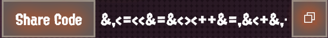

Share Codes allow you to save and share your palettes with people!

Each code consists of 36 characters which each correspond to one color chip placed on the palette.

You can click the copy button or copy it in the entry field and paste it elsewhere to share the code!

To import a palette, paste the code in the box!

(Here's the above one: `&,<=<<&=&<><++&=,&<+&,+<=+,&=&+><<+&`)

### Reset, Randomize, Flip, etc

Several buttons exist to quickly modify your palette in various ways:

- Reset - Resets the palette back to empty.
- Randomize - Randomizes the full palette of color chips, if the logic option is enabled, it will attempt to ensure the resulting palette is valid as well.
- Randomize Tones - Randomizes an existing palette's tones between A, B, and C. For example, if a particular chip is Support Tone B, it could be chosen to be, Support Tone A, C, or B again. This option is useful if you use one flat tone first to draw out the palette, then randomize the tones to give it more texture if you don't need specific ones. If logic is enabled, it will attempt to ensure the resulting palette is valid as well.
- Flip Horizontally - Flips an existing palette's color chips across the Y-axis (centered). If a color chip were in the top left corner, it would now be in the top right corner instead.
- Flip Vertically - Flips an existing palette's color chips across the X-axis (centered). If a color chip where in the top left corner, it would now be in the bottom left corner instead.
- Shuffle - Modifies an existing palette by moving around its color chips to random positions.

### Hacks

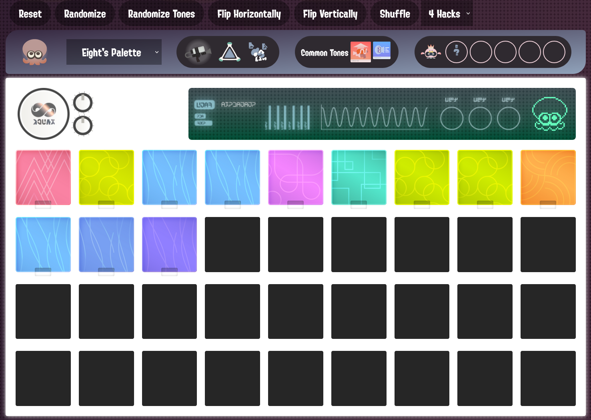

When using Eight's Palette, a dropdown will appear to select the number of hacks to be used, which will restrict the appropriate number of slots.

### Palette Info Bar

The Palette Info Bar gives you specific details about your palette's character, weapon, sub, special, and biased color chips.

It will also display the Drone Abilities that your palette has, or might have, according to the chips you've placed.

### Hotkeys

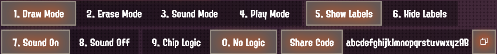

You can press the corresponding numbers of the options as hotkeys to change them.

This can be helpful to quickly switch between modes!

While in Play Mode, the left and right arrow keys allow you to progress the marker through the palette, to track progress as you play.

## Support

If you like the things I make, consider supporting me on my [ko-fi page](https://ko-fi.com/epicyoshimaster)!
